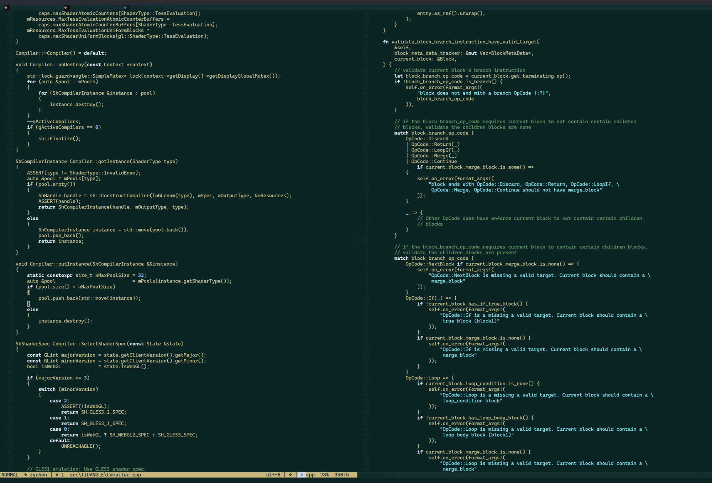

 
# systems-nvim

A minimalist nvim configuration focused on C, C++, Rust systems codebases.



## Focus

* C/C++ navigation with `clangd`
* Rust navigation with `rust-analyzer`
* Support for generated build metadata such as:
  * `compile_commands.json`
  * `rust-project.json`
* Telescope tuned for large repositories with `out/`, `build/`, and generated directories
* Filename-first file search display
* Minimal dark theme
* Simple LSP keymaps for definitions, references, callers, callees, rename, hover, and diagnostics

## Layout

```text
init.lua
lua/
  config/
    windows.lua
    macos.lua
    linux.lua
```

`init.lua` only detects the current platform and loads the matching full config file.

Each platform config is intentionally kept as a single file for easier debugging and sharing.

## Windows

The Windows config is the primary config for now.

Expected external tools:

* clangd
* rust-analyzer

## Status

Work in progress. The Windows config is actively used. macOS and Linux configs will be ported later.
